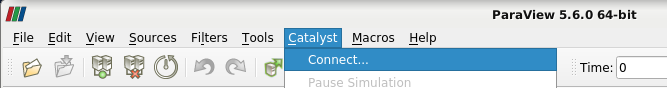
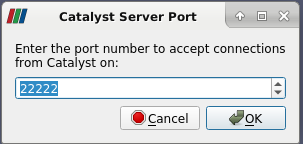
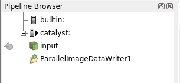
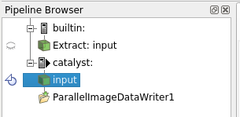
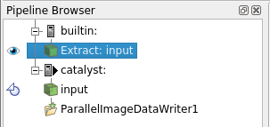
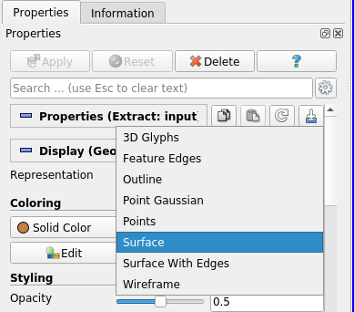

# Installation of Damaris with Catalyst Support with Spack 

## Install and configure Spack {#configure_spack}

We will be using Spack ([https://spack.io/](https://spack.io/)) to install the full graph of dependencies of Damaris with Catalyst support. This will require a couple of hours on 4 or so cores to complete and is best done on a compute node with multiple cores (see [Appendix](#appendix_grid5000) for instructions on how to request extra resources on Grid5000).  

1. Obtain Spack

  - If Spack is not available (try `which spack`) on your system then download it via `git`

```bash
        # Create a directory for Spack
        mkdir ~/myspack
        cd ~/myspack
        # download the Spack repository
        git cone https://github.com/spack/spack.github
        export SPACK_ROOT=$PWD/spack
        . spack/share/spack-env.sh
        spack bootstrap
```

  - If it is available you will need to make a copy so that we can change some Spack files to suit our requirements

```bash
        # Create a directory for Spack
        mkdir ~/myspack
        spack clone ~/myspack
```

2. Ensure the Spack environment is set up in future shells by adding the following to your `~/.bashrc` file 

```bash
        # Set up your editor of choice here
        export EDITOR=nano
        export SPACK_ROOT=~/myspack/spack
        . $SPACK_ROOT/share/spack/setup-env.sh
```

3. Check that your Spack build will use the desired number of cores

```bash
        # Check the config.yaml file
        cat ~/.spack/config.yaml
        config:
        build_stage:
        - ~/.spack/stage

        build_jobs: 4
```

## Building Damaris and Paraview Catalyst dependencies.

For Catalyst installation there is a Spack configuration requirement that needs to be made to ensure Python3 is preferred over Python2 for the whole set of dependencies. The Damaris Spack spec file also needs to be modified to accommodate the Python3 dependency and also to add a CMake flag so that example code is compiled.   

### Set up the Spack packages.yaml to have the following section: 
This should prevent installed libaries from using Python2 and Spack *py-packages* seem to get mixed up due to their Python2/3 dependencies.

```bash
    cat ~/.spack/packages.yaml
---
packages:
  python: 
    version: [3,2]
```

### Update the Damaris spec file
Make sure the Damaris Spack 'spec' file is updated to specify `catalyst+python3` *not* `catalyst+python`. Also needed in the file are commands to add a CMake `examples` variant and the CMake flag to build the Damaris examples.

```python
>spack edit damaris
    ...
    variant('examples', default=False, description='Enables compilation and installation of the examples code')
    ...
    depends_on('catalyst+python3', when='+catalyst@5.6')
    ...
    cmake_args()    
        ...
        if (self.spec.variants['examples'].value):
            args.extend(['-DENABLE_EXAMPLES:BOOL=ON'])

```
### Create a Spack environment
We will create a Spack *environment* to work from. This is a filesystem area that will contain all the libraries needed to run and build Damaris and its dependent executable simulation code. Environments are easily created from Spack installed libraries and can be removed easily without removing the underlying Spack installed library. The activation of the environment will set the `PATH`, `LIBRARY_PATH`, `CPATH`, `LD_LIBRARY_PATH`, `PKG_CONFIG_PATH`, `MANPATH` environment variables to the view of the system specific to the installed libarires and dependencies. One should note that common tools may not be available without installing them specifically in the environment (e.g. the `nano` editor) or possibly loading them using modules. 
  
```bash
    # create and the activate a spack environment
    spack env create damaris-catalyst
    spack env activate damaris-catalyst
```
  
### Install Damaris  
The following `spack install` command should build and install Damaris and all of its dependencies including the Paraview Catalyst libraries. This process can take a long time (multiple hours). If a particular part fails ([LLVM for example ](#llvm_install_issues)) then the Spack environment should be removed using `spack env rm <env-name>` and then re-created. The `--keep-stage` option is needed so that the Damaris examples are not removed when the build directory is cleaned, as the Damaris Spack install does not install the examples for us.  
  
```bash
    # Install Damaris and dependencies
    spack install --keep-stage damaris+catalyst+hdf5+examples ^catalyst@5.6.0+osmesa+rendering ^mesa+osmesa swr=avx ^llvm@7.0.0 target=sandybridge
```  
  
The Mesa 'swr' option can be specified for x86_64 CPUs dependent on the architecture of the CPU on the compute nodes. I have specifed `swr=avx` and `target=Sandybridge` so that libs are compatible with my VM CPU.


## Run a Damaris example and have it connect to Paraview {#run_damaris_example}
Download and install a Paraview version that matches the version of Catalyst that was installed via Spack available here: [https://www.paraview.org/download/](https://www.paraview.org/download/). There are pre-compiled executables available for Windows, Mac and Linux. When using Linux on compute nodes or on a VM no GPU support then check out notes on running with Mesa in [appendix below](#notes_on_mesa).  

### Find and set up the example simulation code
To access the examples from the Damaris Spack build directory use the `spack cd` command and navigate to the build directory.
  
```bash
    # Check what the Spack install spec configuration was
    # (from withing the environment)
    spack config edit
    
    # 'spack cd' gets us to the install directory
    spack cd damaris+catalyst+hdf5+examples ^catalyst@5.6.0+osmesa+rendering ^mesa+osmesa swr=avx ^llvm@7.0.0 target=sandybridge

    # Now find the build directory and examples that we kept 
    # using '--keep-stage'
    cd ../spack-build/examples/paraview
    # Copy the input damaris xml files and catalyst python scripts 
    # to the executables
    cp ../../../spack-src/examples/paraview/*.xml .
    cp ../../../spack-src/examples/paraview/*.py  .

```
  
Now we have the examples compiled, check the configuration of the xml file

1. Select the number of dedicated cores (per node).
2. Ensure image.xml file has the current path to the *image.py* Catalyst script corrected
3. Ensure the <paramater name="size" value = (mpi_proc_per_node - dedicated cores)`

```xml
        <architecture>
            ...
            <dedicated cores="1" nodes="0" />
            ...
        </architecture>
        <data>
            ...
            <parameter name="size"	 type="int" value="3"  />
            ...
        </data>
        ...
        <paraview>
            <script>image.py</script>
        </paraview>
```

### Launch Paraview GUI
Now launch the Paraview GUI and then select the Catalyst menu and select "Connect"  
  
{ width=550px } 
  
In the text box that is presented you can select the port on which to listen, which will need to be the same one as specified in the example code Catalyst *.py* file python script (the *.py* script is specified in the Damaris *.xml* configuration file in the `<paraview` tag). Port 22222 is a default value so should work as given, so now click `OK`.  
  
{ width=240px }
  
### Execute the example simulation code
The next step is to execute the simulation code using `mpirun` and the appropriate number of processes. For testing on a single node, the OpenMPI `--oversubscribe` flag may be needed if there are not as many cores available as processes being run.  
  
```bash
    # Make sure you are in the spack-build/examples/paraview 
    # examples directory (use `spack cd ...`)
    # This is a typical Damaris example where the Damaris 
    # configuration xml file is specified on the command line
    mpirun --oversubscribe -np 4 ./image "image.xml" 
```
  
### Render the simulation data using Paraview
ParaView should soon find the connection and present a *catalyst* option in the *Pipeline Browser* tab  
  
{ width=240px }  
  
The data in this case is named *input* and can be selected for display within the *builtin* pipeline viewer and then shown with default bounds and color by selecting the *eye* icon to view:  
  
{ width=240px }  

{  width=240px }  

Now that the data is available in the Pipeline Browser the full set of visualization possibilities are available through ParaView. To start with the data is rendered in a very conservative manner - as a bounded box with single set color. The dataset can be rendered and colored by modifying the *Representation* and *Color* of the dataset using either the *Active variable control* toolbar or the *Properties* tab on the *Pipeline Browser* View panel as seen in fig.6 and fig.7 below.  

{ width=550px }  
  
{ width=280px }  


{ \pagebreak }


## Appendix

### A1. Request resources from Grid5000 {#appendix_grid5000}
[Back](#configure_spack)

```bash
    ssh <username>@rennes
    
    # Check if there are nodes available
    funk -m date -r rennes -w 04:00:00
    
    # request 4 cores (or more) 
    oarsub -I -p "cluster='paravance'" -l /nodes=1/core=16,walltime=02:00:00
    
    # Check that your spack build will use all cores:
    cat ~/.spack/config.yaml
config:
build_stage:
- ~/.spack/stage

build_jobs: 16
```

We will also need OpenMPI set up correctly to use the `oarsh` helper to talk to nodes  
```bash
    cat ~/.openmpi/mca-params.conf 
# orte_rsh_agent=oarsh  # for pre-ompi@3.1
plm_rsh_agent=oarsh
filem_rsh_agent=oarcp

```

The `oarsh` command is the same one used to access nodes requested via `oarsub`.
This is how you use `oarsh` to log into the job running your node
```bash
    # check what job I am running (if forgotten)
    oarstat -cu <username>
Job id     Name           User           Submission Date     S Queue
---------- -------------- -------------- ------------------- - ----------
1270759                   <username>        2020-05-27 15:43:50 R default   

    # export the job number of interst
    OAR_JOB_ID=1270759
    # print the given nodes provided by the job
    oarstat -fj $OAR_JOB_ID | grep assigned_hostnames | sed -n 's/^.*= //p'
    paravance-28.rennes.grid5000.fr

    # the OAR_JOB_ID variable is used by oarsh
    oarsh paravance-28  
    # you should now be on the node
```


### A2. Set up sshfs
Set up sshfs between a VM and Grid5000 user Rennes NFS filesystem

```bash
    ssh <vm-name>.grid5000.fr
    sudo apt-get update 
    sudo apt-get install sshfs
    sudo gpasswd -a <username> fuse # (add myself to fuse group)

    # make the local shared directory
    mkdir ~/sshfslocal
    # Make the remote shared directory
    ssh  <username>@frennes.rennes.grid5000.fr mkdir /home/<username>/sshfsshare
    # Set up the filesystem between the two directories
    sshfs <username>@frennes.rennes.grid5000.fr:/home/<username>/sshfsshare /home/<username>/sshfslocal

```

### A3. Some notes on Graphics drivers on Linux: {#notes_on_mesa}
[Return to Run Damaris Example](#run_damaris_example)  

Running Catalyst on systems without dedicated graphics hardware (i.e. VM, compute nodes of clusters) requires Mesa 3D graphics libraries which are used for OpenGL rendering support. Mesa uses the llvm infrastructure so llvm will be installed as a dependency (see [LLVM Installation Issues](#llvm_install_issues)).
For a better understanding of the Mesa driver infrastructure and its multiple options, please see: [www.paraview.org/ParaView_And_Mesa_3D](https://www.paraview.org/Wiki/ParaView/ParaView_And_Mesa_3D)) 

OSMesa ("Off Screen Mesa") is the front end to various drivers that provide different levels of acceleration support.
For X86_64 with AVX (or greater) instructions there is the Gallium driver *swr* otherwise *llvmpipe* is available for multiple CPU targets. There is also a fallback single threaded driver *softpipe*.  

Once LLVM and Mesa are installed there are some environment variables to tweak.  
(see: [www.mesa3d.org/envvars.html](https://www.mesa3d.org/envvars.html) )

```bash
    export GALLIUM_DRIVER=softpipe|llvmpipe|swr

    # If llvmpipe is chosen, the number of threads to use is 
    # selected as follows
    # llvmpipe is only threaded in the pixel operations 
    # so the thread level has no improvement in vertex rendering. 
    # N.B. Catalyst/MPI adds capability for vertex rendering.
    export LP_NUM_THREADS=2

    # if swr is available (X86_64 only), it is threaded in vertex and pixel operations
    export KNOB_MAX_WORKER_THREADS=1..256
```
Other performance tips for using the Mesa are available [www.mesa3d.org/perf.html](https://www.mesa3d.org/perf.html)  

  
### A4. Build and Install Damaris from git repository
Use the following guide to manually compile a development version of Damaris within a Spack environment that has Catalyst installed.

#### Download development version from gitlab
```bash
    # N.B. git may not be available from the spack environemnt (i.e. first use despactivate)
    git clone https://gitlab.inria.fr/Damaris/damaris-development.git 
```

#### Build Damaris examples with Catalyst support (no VisIt)

N.B. install_path can be determined using spack env st

```bash
    spack env activate damaris-catalyst

    cd damaris-development/build
    mkdir mybuild
    cd mybuild

    export install_path=~/spack/var/spack/environments/damaris-catalyst/.spack-env/view
    hdf5_arg="-DENABLE_HDF5=ON -DHDF5_ROOT=$install_path"
    visit_arg="-DENABLE_VISIT=OFF -DVisIt_ROOT=$install_path"
    catalyst_arg="-DENABLE_CATALYST=ON -DParaView_DIR=$install_path"
    cmake ../../.. -DCMAKE_INSTALL_PREFIX:PATH=$install_path \
	-DBOOST_ROOT=$install_path \
	-DXSD_ROOT=$install_path \
	-DXercesC_ROOT=$install_path \
	-DCppUnit_ROOT=$install_path \
	-DCMAKE_CXX_COMPILER=mpicxx \
	-DCMAKE_C_COMPILER=mpicc \
	-DENABLE_TESTS=OFF \
	-DENABLE_EXAMPLES=ON \
	-DBUILD_SHARED_LIBS=ON \
	$visit_arg \
	$hdf5_arg \
	$catalyst_arg

    cd examples/paraview
    make -j 4
    make install

```
  

### A5. Installation of dependencies on VM with restricted memory
I had trouble installing Catalyst on a Debian 10 VM, which was narrowed down to the limited amount of RAM available (2GB running XFCE over Xrdp/VNC). This affected LLVM and Catalyst builds (vtkDataArray.cxx compile was a common fail point). On machines where LLVM did compile then the Mesa build would fail for LLVM versions >=9.0. The Spack Mesa installation is restricted to versions <=18.3.6 when installing with Spack as the build system was changed from autotools to meson after that version.

#### To overcome LLVM installation issues {#llvm_install_issues}
LLVM was a source of multiple issues during installation of Damaris with visualization support when using Spack. 
1. Need for a machine with a good amount of RAM otherwise the LLVM build will fail.  
2. LLVM versions <=8.0.0 are compatible with the Mesa installed by Spack (mesa@18.3.6)  

A way around the RAM requirement is to get Spack to use a system installed llvm. You may need to install clang/llvm using your system package manager first.  

```bash
    # use sudo-g5k for Grid5000 builds
    sudo apt-get install clang  
    clang --version

    # Add dependency to packages.yaml
    cat ~/.spack/packages.yaml
---
packages:
  python: 
    version: [3,2]
  llvm:
    buildable: False
    paths:
      llvm@7.0.0: /usr/lib/llvm-7
    version: [7.0]

```
#### Try to fix the Catalyst build fail
I downloaded and configured a Catalyst repository that had been pre- catalize.py'ed from the ParaView files download site. *It compiled and installed*.
I then created a spack package that used the same source so that Spack could install it in the environment ready for Damaris installation. *The build failed*.   
I then decided to exit my VM and compile from a terminal without TigerVNC and XFCE overheads. *The full `spack install damaris` command worked* - albeit with system installed llvm.
  

### A6. Create a cmake based Spack package from a url download of a repository:
```bash
    # Created a new package spack for some know catalyst code that would build and install
    spack create -n catalyst-mybuild -f -t cmake http://www.paraview.org/files/v5.6/Catalyst-v5.6.0-Base-Enable-Python-Essentials-Extras-Rendering-Base.tar.xz


    # All options are hard-coded and set in the cmake build step by spack.
    # N.B. If LLVM install failed then the llvm version should match what is in the .spack/packages.yaml file
    spack install catalyst-mybuild@5.6.0 ^mesa+osmesa swr=avx ^llvm@7.0.0
```
  
#### The Spack spec file
Available via `spack edit catalyst-mybuild`
  
```python
from spack import *

class CatalystMybuild(CMakePackage):
    """ A package to install catalyst with python3+mpi+rendering with osmesa support.
        The tar archive has cmake already set up for catalyst and uses the pre-made cmake.sh
        to configure the build, adding spack environment details (rpath, install prefix).
        I'm reasonably sure the code is derived from the catalize.py script in the main paraview
        codebase.
        uses Catalyst-v5.6.0-Base-Enable-Python-Essentials-Extras-Rendering-Base.tar.xz
    """

    # FIXME: Add a proper url for your package's homepage here.
    homepage = "https://www.paraview.org"
    url      = "http://www.paraview.org/files/v5.6/Catalyst-v5.6.0-Base-Enable-Python-Essentials-Extras-Rendering-Base.tar.xz"

    # Add a list of GitHub accounts to
    # notify when the package is updated.
    maintainers = ['jcbowden']

    version('5.6.2-Base-Enable-Python-Essentials-Extras-Rendering-Base', sha256='61ed20028f23d5e8926e8783d8ff6ce6503e8989a12cd83e1a8422d571')
    version('5.6.1-Base-Enable-Python-Essentials-Extras-Rendering-Base', sha256='dd60dead6469cce91014f31137b386860078dc284231ea2da2fc884b21')
    version('5.6.0-Base-Enable-Python-Essentials-Extras-Rendering-Base', sha256='198440b2a95b585db6063cce04809f49ca19f8bbf5b219356cb615da26')


    depends_on('git', type='build')
    depends_on('mpi')
    depends_on('python@3:', type=('build', 'link', 'run'))

    depends_on('py-numpy', type=('build', 'run'))
    depends_on('py-mpi4py', type=('build', 'run'))

    depends_on('gl@3.2:')
    depends_on('mesa+osmesa')
    # depends_on('glx', when='+rendering~osmesa')
    depends_on('cmake@3.3:', type='build')

    def setup_run_environment(self, env):
        # paraview 5.5 and later
        # - cmake under lib/cmake/paraview-5.5
        # - libs  under lib
        # - python bits under lib/python2.8/site-packages
        if os.path.isdir(self.prefix.lib64):
            lib_dir = self.prefix.lib64
        else:
            lib_dir = self.prefix.lib

        if self.spec.version <= Version('5.4.1'):
            lib_dir = join_path(lib_dir, paraview_subdir)
        env.set('ParaView_DIR', self.prefix)
        env.prepend_path('LIBRARY_PATH', lib_dir)
        env.prepend_path('LD_LIBRARY_PATH', lib_dir)

        python_version = self.spec['python'].version.up_to(2)
        env.prepend_path('PYTHONPATH', join_path(lib_dir,
                         'python{0}'.format(python_version),
                         'site-packages'))

    def setup_dependent_build_environment(self, env, dependent_spec):
        env.set('ParaView_DIR', self.prefix)


    @property
    def build_directory(self):
        """Returns the directory to use when building the package

        :return: directory where to build the package
        """
        return join_path(os.path.abspath(self.stage.source_path),
                         'spack-build')

    def cmake_args(self):
        """Populate cmake arguments for Catalyst."""
        spec = self.spec

        cmake_args = [
            '-DPARAVIEW_GIT_DESCRIBE=v%s' % str(self.version),
            '-DVTK_USE_SYSTEM_EXPAT:BOOL=ON',
            '-DVTK_USE_X:BOOL=OFF',
            '-DVTK_USE_OFFSCREEN:BOOL=ON',
            '-DVTK_OPENGL_HAS_OSMESA:BOOL=ON',
        ]
        cmake_args.extend([
            '-DPARAVIEW_ENABLE_PYTHON:BOOL=ON',
            '-DPYTHON_EXECUTABLE:FILEPATH=%s' %
            spec['python'].command.path,
            '-DVTK_USE_SYSTEM_MPI4PY:BOOL=ON'
        ])

        if spec.platform == 'linux' and spec.target == 'aarch64':
            cmake_args.append('-DCMAKE_CXX_FLAGS=-DPNG_ARM_NEON_OPT=0')
            cmake_args.append('-DCMAKE_C_FLAGS=-DPNG_ARM_NEON_OPT=0')

        return cmake_args

    def cmake(self, spec, prefix):
        """Runs ``cmake`` in the build directory through the cmake.sh script"""
        cmake_script_path = os.path.join(
           os.path.abspath(self.root_cmakelists_dir),
           'cmake.sh')
        with working_dir(self.build_directory, create=True):
           subprocess.check_call([cmake_script_path,
                                  os.path.abspath(self.root_cmakelists_dir)] +
                                  self.cmake_args() + self.std_cmake_args)

```
